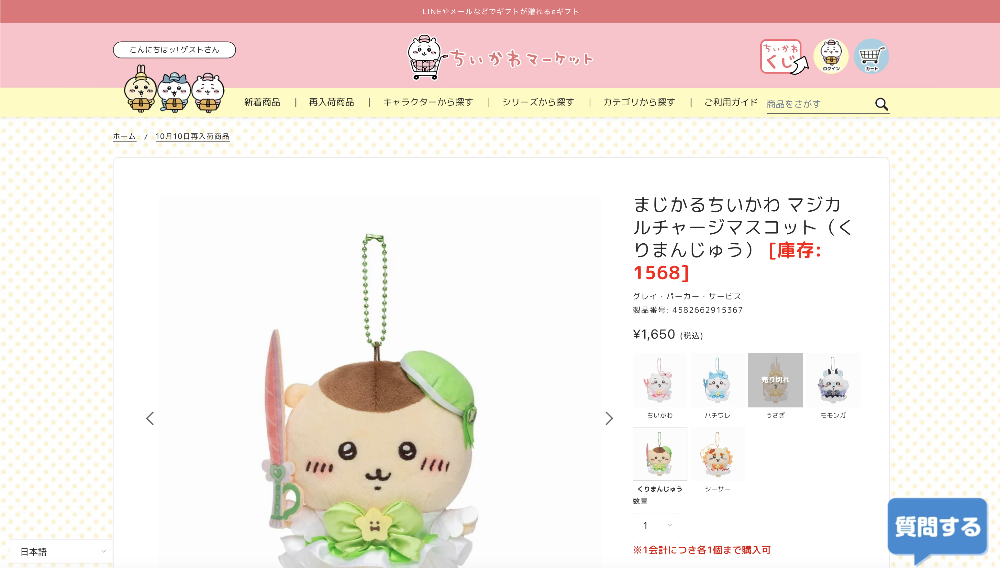

# Chiikawa Market Storage Checker

Check storage of products in Chiikawa market.

Remove annoying worldshopping button in the page.

## How to Use

### All PC (Chromium based browsers)

Install [Tampermonkey](https://chromewebstore.google.com/detail/dhdgffkkebhmkfjojejmpbldmpobfkfo)

https://raw.githubusercontent.com/liaojack8/chiikawa-market-better/master/chiikawa-market-better.user.js

or

https://cdn.jsdelivr.net/gh/liaojack8/chiikawa-market-better/chiikawa-market-better.user.js

### Apple iPhone or iPad

Choose the app one u prefer

[Stay](https://apps.apple.com/tw/app/id1591620171)

[Userscripts](https://apps.apple.com/tw/app/id1463298887)

### Android Devices

[Kiwi Browser](https://play.google.com/store/apps/details?id=com.kiwibrowser.browser&hl=zh_TW) with [Tampermonkey](https://chromewebstore.google.com/detail/dhdgffkkebhmkfjojejmpbldmpobfkfo)

## License

Chiikawa Market Storage Checker is licensed under [the MIT License](/LICENSE).
